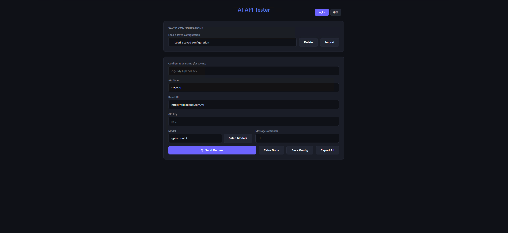

# AI API Tester

A simple, self-hosted web UI for testing and debugging any OpenAI-compatible API endpoint.

This tool allows you to quickly check your API's model availability, test chat completions, and inspect raw responses, all from a clean and simple interface. It's perfect for developers working with different LLM providers or self-hosted models.


*(You can replace the URL above with a real screenshot of the application)*

## Features

- **Multi-language Support**: Switch between English and Chinese (more languages can be added).
- **Provider Agnostic**: Works with any API that follows the OpenAI `v1/chat/completions` and `v1/models` format, as well as native Anthropic and Gemini APIs.
- **Model Discovery**: Fetches and displays a list of available models from your endpoint.
- **Request Testing**: Send test messages to any model and view the response.
- **Detailed Response Views**: Inspect the raw JSON response, the extracted message content, and the HTTP headers.
- **Configuration Management**:
    - **Save**: Store multiple API endpoint and key configurations in your browser's local storage.
    - **Load**: Quickly switch between saved configurations using a dropdown menu.
    - **Delete**: Remove configurations you no longer need.
    - **Import/Export**: Easily backup and restore your configurations.
- **No Database Needed**: All configurations are stored client-side in your browser.
- **Easy to Run**: A simple Node.js Express server hosts the static frontend.

## Getting Started

### Prerequisites

- [Node.js](https://nodejs.org/) (v18 or later recommended)
- [npm](https://www.npmjs.com/)
- [Docker](https://www.docker.com/) (Optional, for containerized deployment)

### Installation & Running (Local)

1.  **Clone the repository:**
    ```bash
    git clone https://github.com/your-username/api-cheak.git
    cd api-cheak
    ```

2.  **Install dependencies:**
    ```bash
    npm install
    ```

3.  **Start the server:**
    ```bash
    npm start
    # Or for development with hot-reload:
    npm run dev
    ```

4.  **Open the application:**
    Open your web browser and navigate to `http://localhost:55443`.

### Production Build

To build the frontend for production (copies files to the `dist` directory):

```bash
npm run build
```
When `NODE_ENV=production` is set, the server will automatically serve files from the `dist` directory instead of `public`.

### Docker Deployment

You can easily deploy the application using Docker. The provided Dockerfile uses a multi-stage build to keep the final image small and secure.

#### Using Docker CLI

1.  **Build the Docker image:**
    ```bash
    docker build -t api-tester .
    ```

2.  **Run the container:**
    ```bash
    docker run -d -p 55443:55443 --name api-tester api-tester
    ```
    You can also pass environment variables to configure the timeout or port:
    ```bash
    docker run -d -p 8080:8080 -e PORT=8080 -e TIMEOUT_MS=120000 --name api-tester api-tester
    ```

#### Using Docker Compose

For an even simpler deployment, you can use Docker Compose:

1.  **Start the service in the background:**
    ```bash
    docker-compose up -d
    ```

2.  **Stop the service:**
    ```bash
    docker-compose down
    ```

You can modify the `docker-compose.yml` file to adjust ports or environment variables as needed.

## Configuration

You can configure the server using a `.env` file. Copy `.env.example` to `.env` and modify the values:

```env
HOST=0.0.0.0
PORT=55443
TIMEOUT_MS=60000
```

## How to Use

1.  **Enter API Details**: Fill in the `Base URL` of your API endpoint (e.g., `https://api.openai.com/v1`) and your `API Key`.
2.  **Save Configuration (Optional)**: Give your configuration a `Configuration Name` (e.g., "My OpenAI Key") and click `Save Config`. It will now be available in the "Saved Configurations" dropdown for future use.
3.  **Fetch Models**: Click `Fetch Models` to see a list of models available with your API key. You can click on any model in the list to select it.
4.  **Send Request**: Type a test message (or use the default "Hi") and click `Send Request`.
5.  **View Response**: The response status, duration, and body will be displayed below. You can switch between `Raw JSON`, `Content`, and `Headers` tabs to inspect the details.

## License

This project is open source and available under the [AGPL-3.0 License](LICENSE).
